# CBS Pick'em Web

Dashboard for our NFL pick'em league run through CBS. We run competitions based on 1st/2nd half and overall and CBS can't track that so started to display the data here.

All the data is written in [https://github.com/RyanThornburg/cbs-pickem](https://github.com/RyanThornburg/cbs-pickem) and just reading the data with this app.

## Screenshots

Player names in these screenshots are replaced with made-up ones. Taken during the 1 PM games of week 4, 2026.

### User Picks

The weekly leaderboard with everyone's picks (live ones show whether they're covering), paid lines, the week's recap strip, and badges for streaks, movers and the defending champion. The header shows the selected player's picks, place and money standing on every tab.

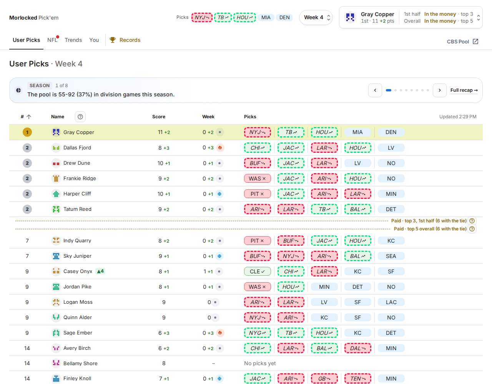

### Player pages

Click a name for that player's page: every week's picks, how they do by kind of pick and by the line, notes on their season, and their finishes over the years. The **You** tab opens the selected player's own page.

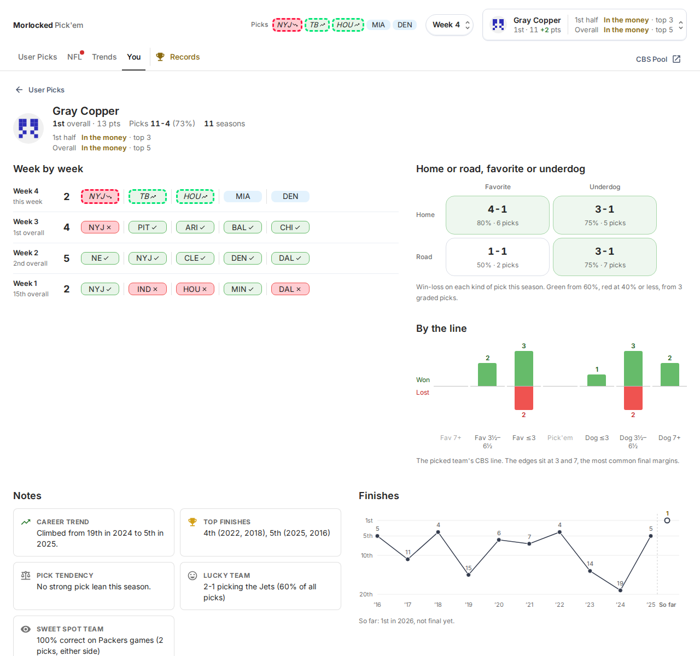

### NFL

One tab with three views. **Games** has the CBS line against Vegas, line moves, O/U, and kickoff weather with an hourly strip.

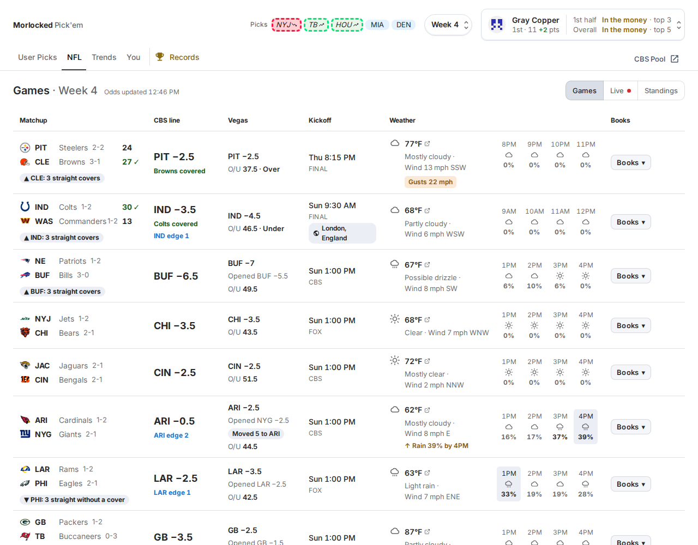

**Live** has scores with your picks summed up on top, who picked each side, and close-game and red-zone borders. Full cards or a compact list.

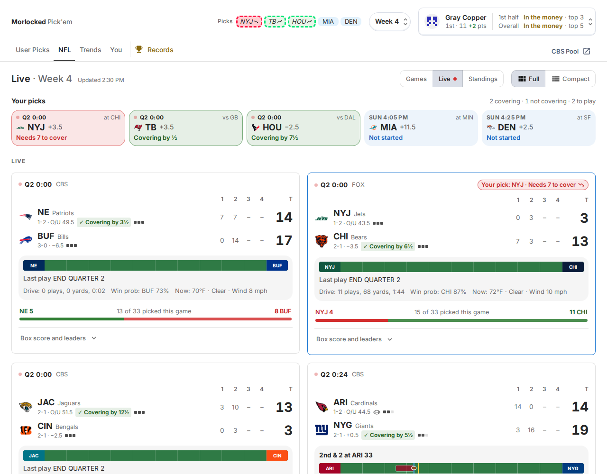

Each live or final game opens to win probability, the margin against the CBS line, leaders, scoring plays, team stats and every player's stats.

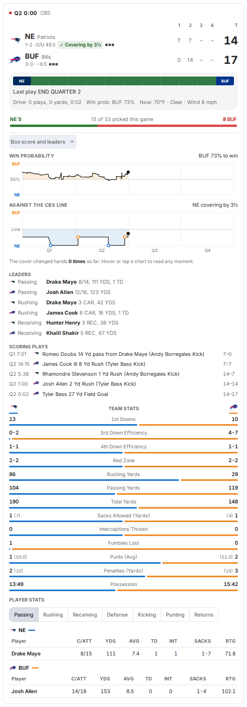

**Standings** has every division with each team's record against the CBS line and the pool's record picking them. Team marks link to team pages.

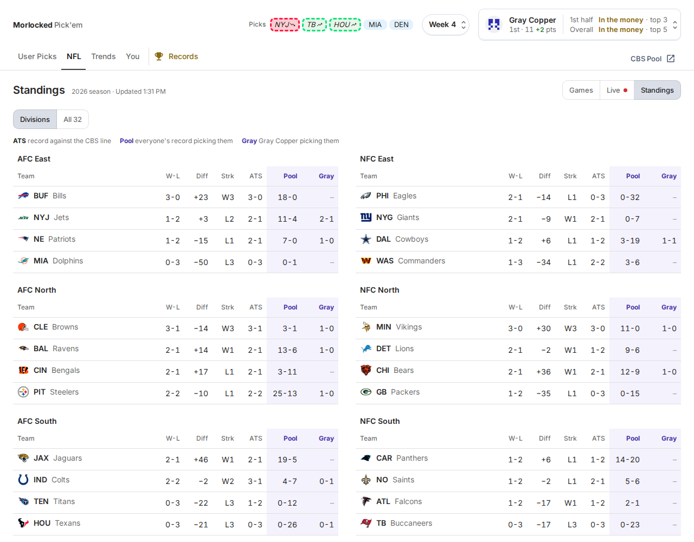

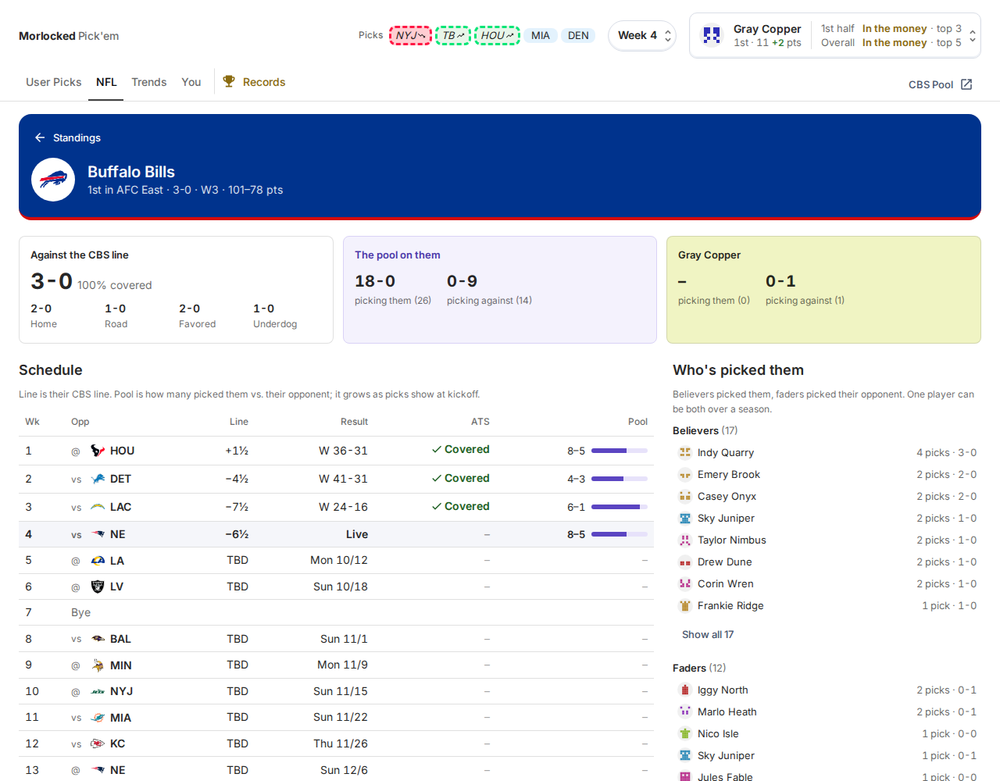

### Trends

The week's recap cards, how the pool split on each game, and the picks nobody else made.

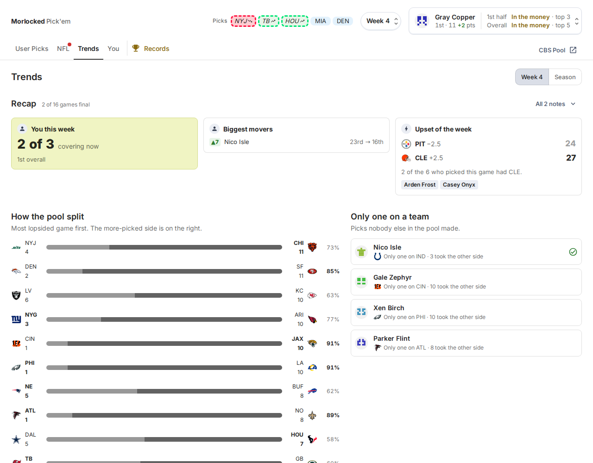

The season's recap, accuracy and chaos charts, and a table of the teams the pool picks.

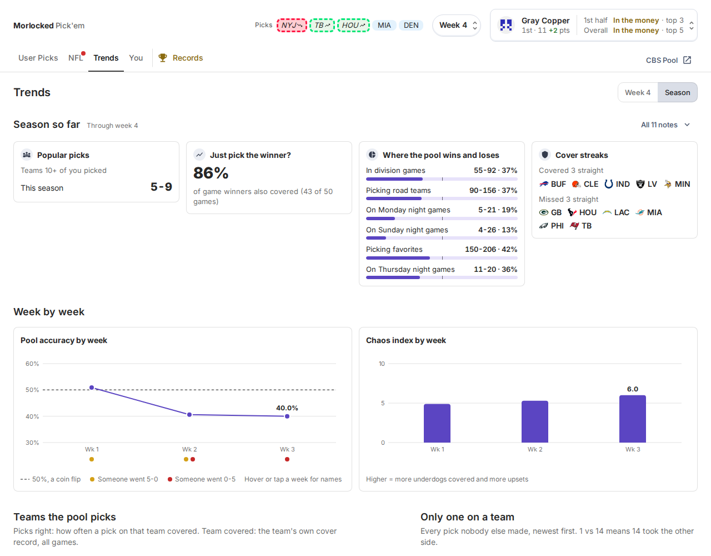

### Records

Your all-time line, every champion back to 2013, and each player's finish by year.

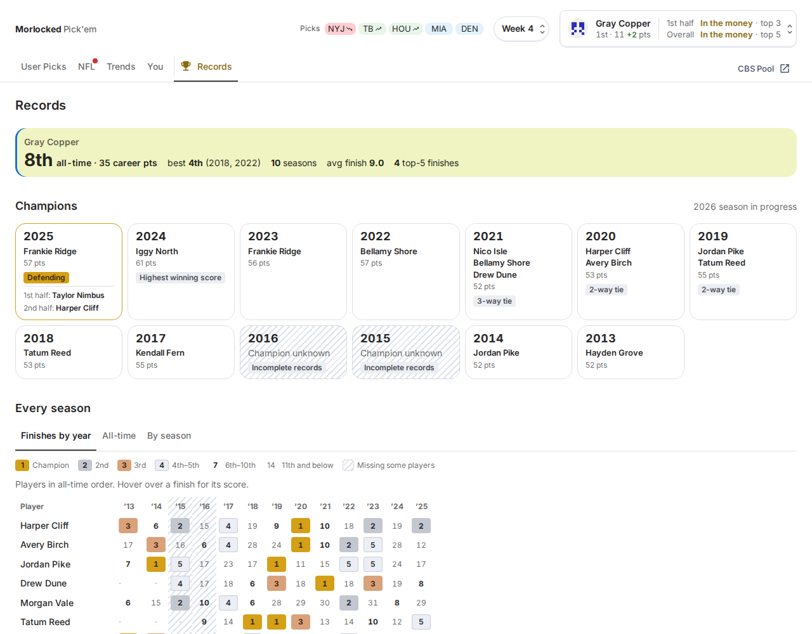

### On a phone

  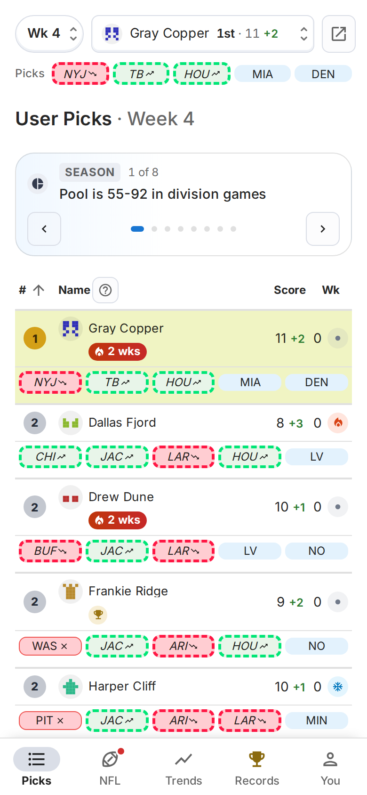
  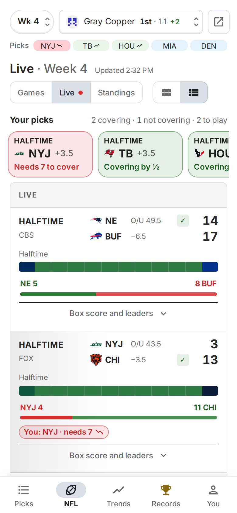

## Stack

- Vite + React + TypeScript, MUI
- Cloudflare Worker + KV for data

## Commands

- `npm start` runs the dev server at localhost:3000
- `npm run build` builds for production into `build/`
- `npm test` runs the tests (Vitest)
- `npm run lint` / `npm run format`

## Project layout

- `src/dashboard/components/` one folder per tab or widget (UsersTable, Nfl, GamesCard, Scoreboard, Players, TrendsSection, RecordsSection, etc.)
- `src/dashboard/types.ts` shared data types
- `worker/` the Cloudflare Worker that serves data from KV
- `src/dashboard/icons/` team logo PNGs
- `docs/screenshots/` the images above

## Note on AI usage

Relied heavily on AI usage for v2. See `CLAUDE.md` for architecture notes.
