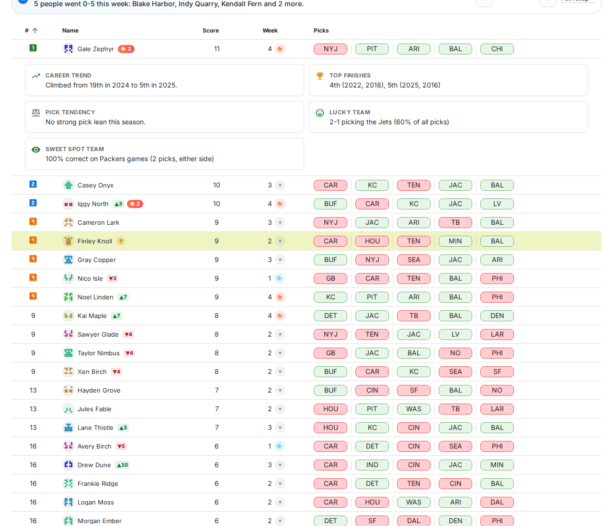
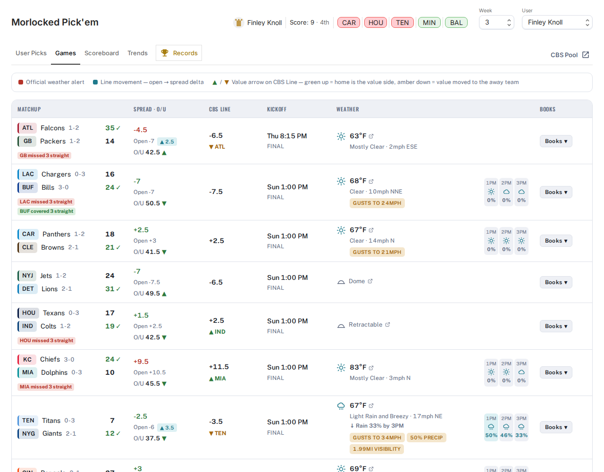
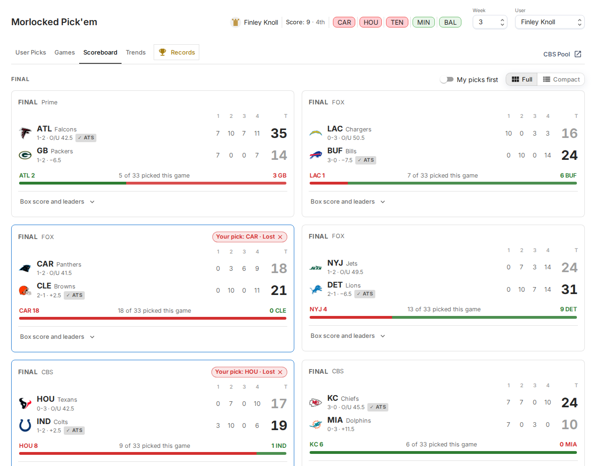
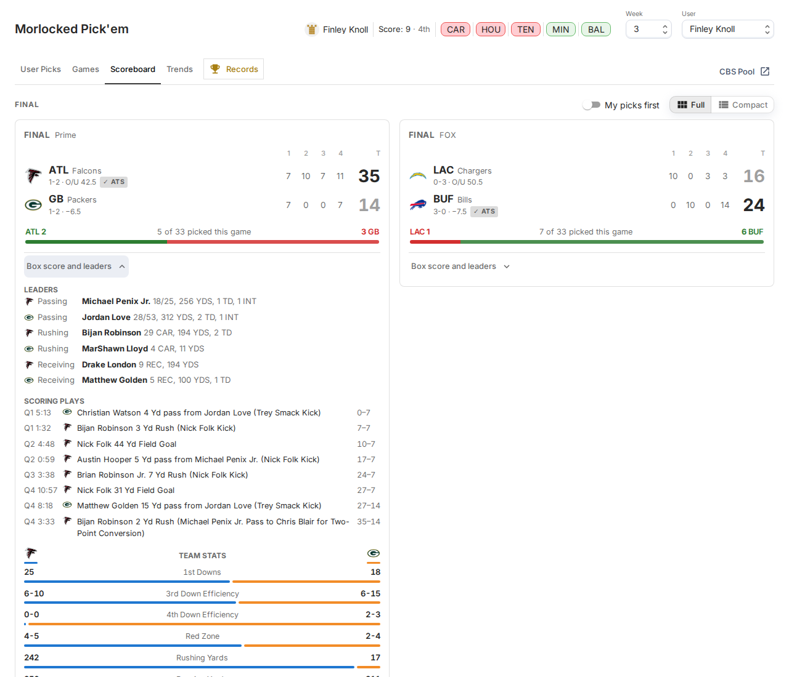
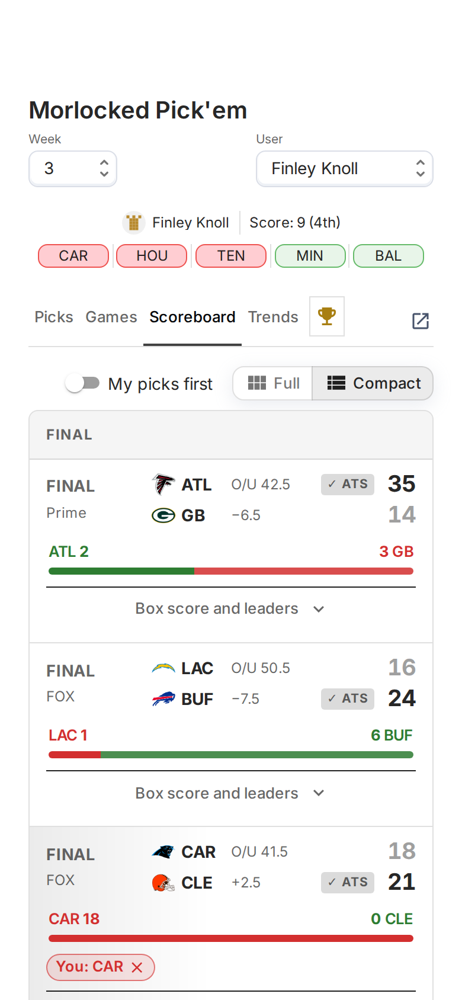

# CBS Pick'em Web

Dashboard for our NFL pick'em league run through CBS. We run competitions based on 1st/2nd half and overall and CBS can't track that so started to display the data here.

All the data is written in [https://github.com/RyanThornburg/cbs-pickem](https://github.com/RyanThornburg/cbs-pickem) and just reading the data with this app.

## Screenshots

Player names in these screenshots are replaced with made-up ones.

### User Picks

The weekly leaderboard with everyone's picks, the week's recap strip, and badges for streaks, movers and the defending champion.

Click a row for that player's season trends.

### Games

Lines, market spread and movement, O/U, and kickoff weather with an hourly strip.

### Scoreboard

Live and final scores with quarter scores, who picked each side, and your pick's status.

Each game opens to its leaders, scoring plays and team stats.

### Trends

The week's recap cards, consensus, lone picks and line movers.

Season charts and a sortable table of every team.

### Records

Champions and all-time records back to 2013.

### On a phone

  
  

## Stack

- Vite + React + TypeScript, MUI
- Cloudflare Worker + KV for data

## Commands

- `npm start` runs the dev server at localhost:3000
- `npm run build` builds for production into `build/`
- `npm test` runs the tests (Vitest)
- `npm run lint` / `npm run format`

## Project layout

- `src/dashboard/components/` one folder per dashboard widget (Scoreboard, UsersTable, TrendsSection, GamesCard, etc.)
- `src/dashboard/types.ts` shared data types
- `worker/` the Cloudflare Worker that serves data from KV
- `src/dashboard/icons/` team logo PNGs
- `docs/screenshots/` the images above

## Note on AI usage

Relied heavily on AI usage for v2. See `CLAUDE.md` for architecture notes.
